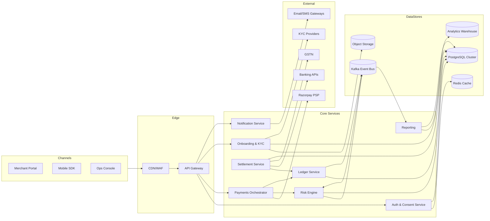
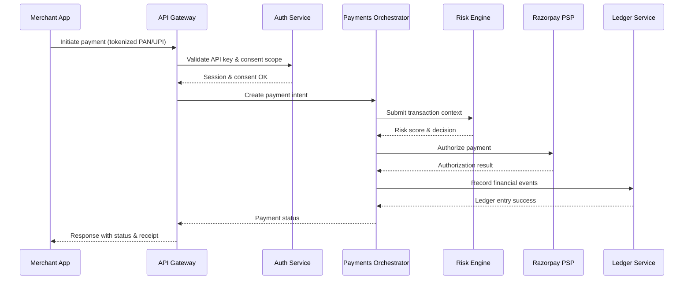
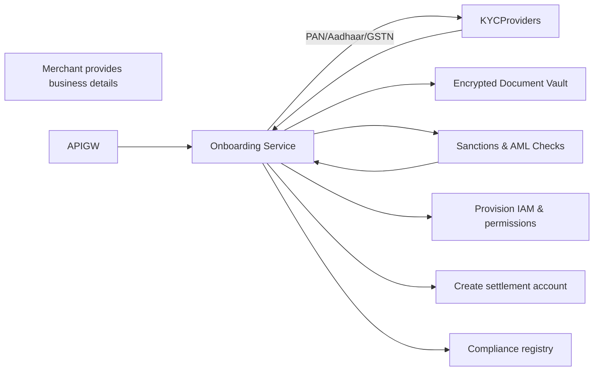
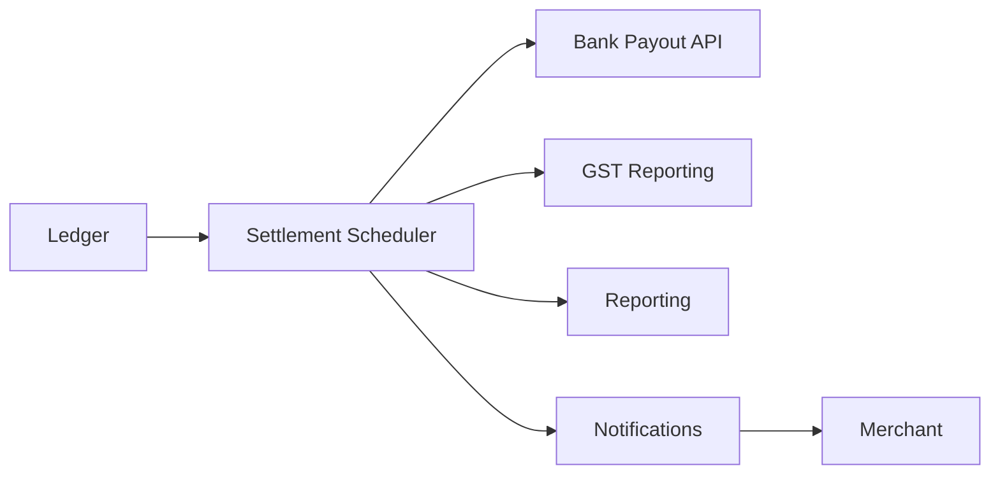

# System Architecture Blueprint

## 1. Context & Assumptions

The platform enables Indian merchants to accept online payments via cards, UPI, and netbanking while providing end-to-end customer onboarding, risk, reconciliation, and settlements. Key assumptions:

- Digital-first merchants integrate via APIs or an operator web console.
- Regulatory perimeter prioritises RBI payment aggregation norms, PCI-DSS for card data, AML/KYC for customer onboarding, GST for taxation, and card network mandates.
- Early releases focus on domestic payments with extensibility for cross-border flows.

## 2. Monorepo Layout

```
/README.md
/docs
  /architecture
  /compliance
  /security
  /product
/apps
  /merchant-portal          # React/Vue frontend for merchants
  /ops-console              # Internal operations UI
  /mobile-sdk               # Client SDK for checkout integrations
/services
  /api-gateway              # Edge routing, throttling, API keys
  /auth-service             # IAM, OAuth2, consent catalogue
  /onboarding-service       # Customer onboarding, KYC orchestration
  /payments-orchestrator    # Routing to payment providers (e.g., Razorpay)
  /risk-engine              # Transaction scoring, AML rules, case mgmt
  /ledger-service           # Double-entry ledger, balances, adjustments
  /settlement-service       # Merchant settlement, GST compliance
  /reporting-service        # Regulatory & merchant reporting
  /notification-service     # Email/SMS/webhook delivery
/libs
  /shared                   # Cross-cutting libraries (logging, telemetry)
  /compliance               # Control definitions, audit utilities
  /schemas                  # Async contract and protobuf/JSON schemas
/infrastructure
  /terraform                # IaC blueprints for cloud resources
  /pipelines                # CI/CD definitions, security scanning
```

## 3. Service Boundaries & Responsibilities

| Service | Responsibility | Key Integrations | Data Stores |
| --- | --- | --- | --- |
| API Gateway | Receive external traffic, enforce rate limits, mutual TLS, API keys, WAF | CDN/WAF, Auth Service | N/A (stateless) |
| Auth Service | Identity & access control for merchants and operators, session mgmt, consent registry | LDAP/IdP, Redis, PostgreSQL | PostgreSQL, Redis |
| Onboarding Service | Merchant/customer onboarding, KYC workflow, document vault | KYC providers (e.g., Karza, Signzy), Object storage | PostgreSQL, S3-compatible storage |
| Payments Orchestrator | Tokenizes instruments, orchestrates payments via Razorpay and other PSPs, handles retries | Razorpay API, PCI token vault | PostgreSQL, Redis |
| Risk Engine | Real-time AML/CFT checks, velocity rules, sanctions screening | AML data providers, Kafka | PostgreSQL, Redis, Kafka topics |
| Ledger Service | Double-entry ledger, balance snapshots, FX handling | Payments Orchestrator, Settlement Service | PostgreSQL (partitioned) |
| Settlement Service | Merchant settlement scheduling, GST invoicing, payouts | Banking APIs, GSTN | PostgreSQL |
| Reporting Service | Regulatory/merchant reports, data warehouse feeds | Ledger, Settlement, Risk | Data warehouse (BigQuery/Snowflake) |
| Notification Service | Outbound communications, templating, event subscriptions | SMS/Email gateways, Webhook endpoints | Redis (queues), PostgreSQL |

Cross-cutting services: centralized logging (ELK/OpenSearch), observability (Prometheus/Grafana), secrets management (HashiCorp Vault or AWS Secrets Manager), and event streaming (Kafka/Pulsar) for asynchronous workflows.

## 4. Supporting Services & Rationale

| Category | Technology | Justification |
| --- | --- | --- |
| Primary database | **PostgreSQL (Cloud-managed)** | Strong ACID guarantees, native JSON for semi-structured data, robust ecosystem, meets PCI and RBI expectations with proper hardening. |
| In-memory cache | **Redis (Managed)** | Low-latency caching for sessions, rate limits, risk rules; supports pub/sub for invalidation. |
| Object storage | **S3-compatible (e.g., AWS S3/MinIO)** | Durable storage for KYC documents, signed URLs for controlled access. |
| Event streaming | **Apache Kafka (Managed)** | High-throughput event pipelines for risk scoring, ledger events, and audit trails. |
| Payment PSP | **Razorpay** | Compliance with RBI regulations, broad payment method coverage, mature reconciliation APIs, allows phased PSP diversification. |
| KYC providers | **Karza + Signzy** | Support for Aadhaar, PAN, GSTIN, and business verification with strong AML tooling and Indian regulatory alignment. |
| CI/CD | **GitHub Actions / GitLab CI** | Automates testing, security scans, IaC deployments with policy checks. |
| Secrets management | **HashiCorp Vault (or AWS Secrets Manager)** | Enforces rotation, policy-based access, and audit trails for sensitive keys. |
| Observability | **Prometheus + Grafana, OpenTelemetry** | Unified metrics, tracing, and logging to satisfy operational and compliance monitoring obligations. |

## 5. High-Level Architecture Diagram



## 6. Core Data Flows

### 6.1 Payment Authorization Flow



### 6.2 KYC & Onboarding Flow



### 6.3 Settlement Cycle Flow



## 7. Non-Functional Considerations

- **Scalability:** Stateless services behind autoscaling groups, database sharding/partitioning for high volume ledgers, async processing for heavy workflows.
- **Reliability:** Active-active deployments across two availability zones, circuit breakers on PSP integrations, idempotent APIs, SAGA-based compensation for multi-step transactions.
- **Observability:** Structured logging with trace IDs, dashboards for PCI and RBI reporting KPIs, automated anomaly detection feeding the risk engine.
- **Data Governance:** Centralized data catalog, PII tagging, masking in lower environments, encryption at rest and in transit for all sensitive datasets.
- **DevEx:** Infrastructure as code, reusable library packages, and automated contract testing for service boundaries.

## 8. Compliance Alignment Traceability

See [`docs/compliance/compliance-obligations.md`](../compliance/compliance-obligations.md) for detailed control mapping. Each service owns its compliance controls, with the Compliance library (`/libs/compliance`) providing shared guardrails (policy checks, audit logging adapters, evidence collection utilities).
